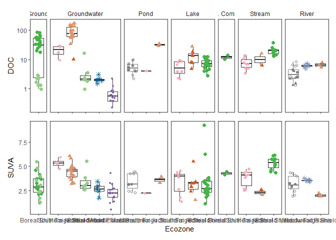
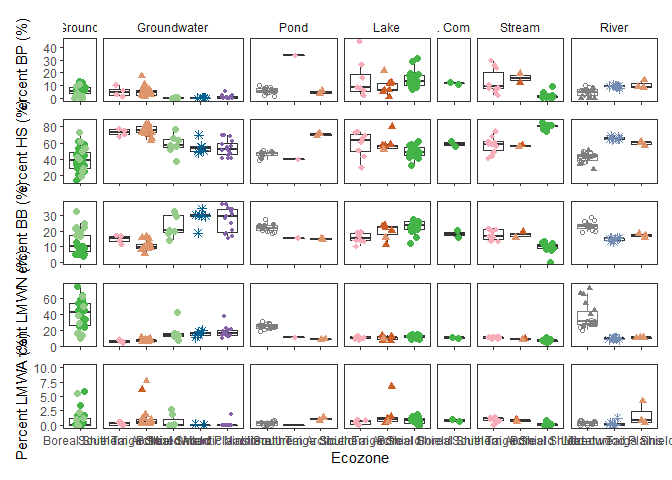
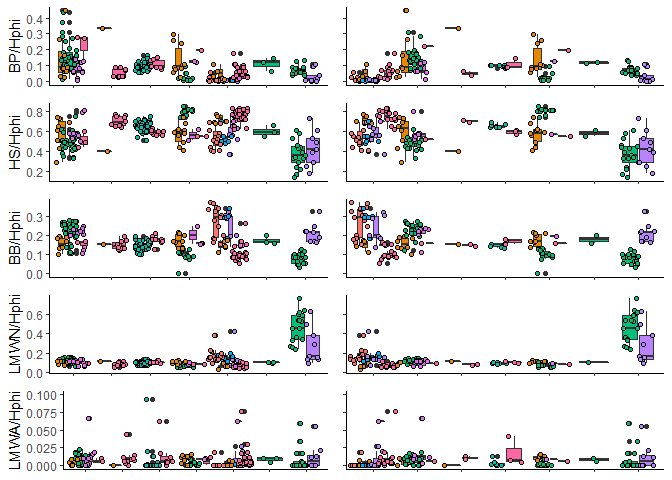
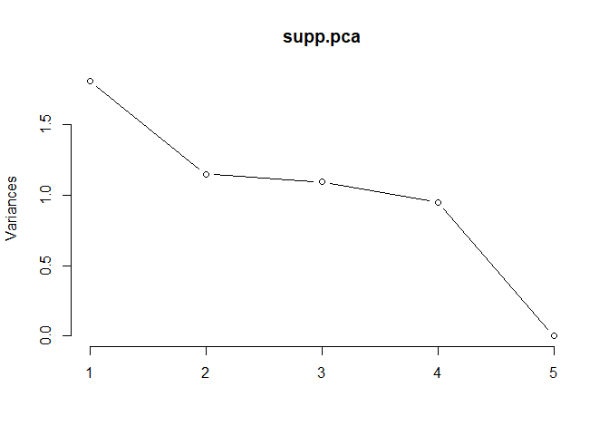
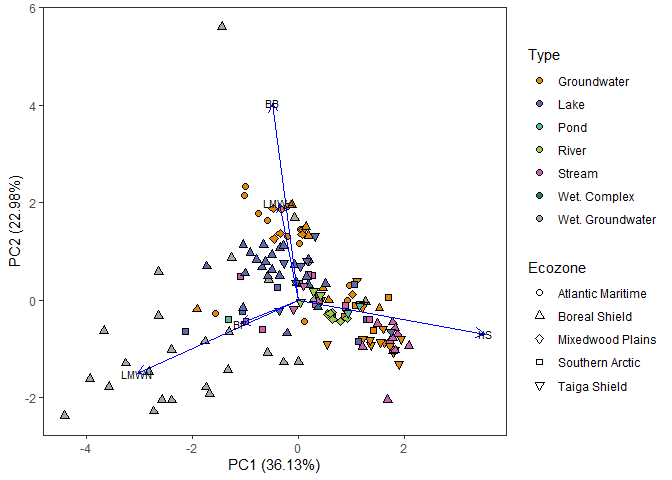

Manuscript Figures
================
PJKA

# Setup

## Install Packages and Import Data

``` r
#Load required libraries
library(tidyverse)
library(patchwork)
library(ggfortify)

#Import dataset file from WLU Dataverse
EnvDOM <- read.csv("Aukes-DOM_Comp_Data-dataset.csv")

#Average samples to result in one value per sampling site
avg_all <- EnvDOM %>%
  select("Env", "Location","Ecozone","Type","LocType","Sample", "DOC","Hphi","BP","HS","BB","LMWN","LMWA","SUVA") %>%
  group_by(Env, Location,Ecozone,Type,LocType,Sample) %>%
  summarise_all(mean) %>%
  ungroup()

#Rename 'Groundwater' to 'Groundwater'
avg_all <- avg_all %>%
  mutate(Type = replace(Type, Type=='Subsurface', 'Groundwater'),
         Type = replace(Type, Type=='Wet. Subsurface', 'Wet. Groundwater'))

#Import literature data
EnvDOM_lit<- read.csv("Aukes-DOM_Comp_lit_search-dataset.csv")
```

# Manuscript Figures

## Figure 1 - Site Location

This was completed using Adobe Illustrator CS6.

## Figure 2 - DOM (mg C/L) and SUVA

``` r
#FIG2A:
fig2a <-
  ggplot(avg_all %>%
         mutate(Ecozone = factor(Ecozone, levels=c("Southern Arctic","Taiga Shield","Boreal Shield","Mixedwood Plains","Atlantic Maritime"))),
       aes(Ecozone,DOC))+
  geom_boxplot(outlier.shape = NA)+
  geom_jitter(aes(shape=Ecozone, colour=Location),width=0.2, size=2)+
  
  geom_boxplot(data=EnvDOM_lit, aes(x=Ecozone, y=DOC), outlier.shape = NA,colour="grey50")+
  geom_jitter(data=EnvDOM_lit, aes(x=Ecozone, y=DOC, shape=Area), width=0.3, colour="grey50", size=1.5)+
  
  scale_shape_manual(values = c(20,16,8,16,1,1,18,17,17))+
  scale_colour_manual(values = c("#8361A9","#F7ACBA","#45B448","#748DB4","#036194","#95CC8A","#CE5C27","#DE956B"))+
  scale_y_log10()+
  facet_grid(.~factor(Type, levels=c('Wet. Groundwater','Groundwater','Pond','Lake','Wet. Complex','Stream','River')), 
             scales='free',
             space='free')+
  theme_bw()+
  theme(panel.grid = element_blank(),
        legend.position = 'none',
        axis.text.x = element_blank(),
        axis.title.x = element_blank(),
        strip.background.x = element_blank()) 

#FIG2B:
fig2b <-
  ggplot(avg_all %>%
         mutate(Ecozone = factor(Ecozone, levels=c("Southern Arctic","Taiga Shield","Boreal Shield","Mixedwood Plains","Atlantic Maritime"))),
       aes(Ecozone,SUVA))+
  geom_boxplot(outlier.shape = NA)+
  geom_jitter(aes(shape=Ecozone, colour=Location),width=0.2, size=2)+
  
  geom_boxplot(data=EnvDOM_lit, aes(x=Ecozone, y=SUVA), outlier.shape = NA,colour="grey50")+
  geom_jitter(data=EnvDOM_lit, aes(x=Ecozone, y=SUVA, shape=Area), width=0.3, colour="grey50", size=1.5)+
  
  scale_shape_manual(values = c(20,16,8,16,1,1,18,17,17))+
  scale_colour_manual(values = c("#8361A9","#F7ACBA","#45B448","#748DB4","#036194","#95CC8A","#CE5C27","#DE956B"))+
  facet_grid(.~factor(Type, levels=c('Wet. Groundwater','Groundwater','Pond','Lake','Wet. Complex','Stream','River')), 
             scales='free',
             space='free')+
  theme_bw()+
  theme(panel.grid = element_blank(),
        legend.position = 'none',
        strip.background.x = element_blank(),
        strip.text.x = element_blank())

(fig2a)/(fig2b)
```

<!-- -->

## Figure 3 - LC-OCD Fractions vs Hydrological Compartment

``` r
fig3a <-   {
ggplot(avg_all %>%
         mutate(Ecozone = factor(Ecozone, levels=c("Southern Arctic","Taiga Shield","Boreal Shield","Mixedwood Plains","Atlantic Maritime"))),
       aes(Ecozone, BP/Hphi*100))+
  geom_boxplot(outlier.shape = NA)+
  geom_jitter(aes(shape=Ecozone, colour=Location, fill=after_scale(alpha(colour, 0.7))),width=0.2, size=2)+
  
  geom_boxplot(data=EnvDOM_lit, aes(x=Ecozone, y=BP/Hphi*100), outlier.shape = NA,colour="grey50")+
  geom_jitter(data=EnvDOM_lit, aes(x=Ecozone, y=BP/Hphi*100, shape=Area), width=0.3, colour="grey50", size=1.5)+
  
  scale_shape_manual(values = c(20,16,8,16,1,1,18,17,17))+
  scale_colour_manual(values = c("#8361A9","#F7ACBA","#45B448","#748DB4","#036194","#95CC8A","#CE5C27","#DE956B"))+
  facet_grid(.~factor(Type, levels=c('Wet. Groundwater','Groundwater','Pond','Lake','Wet. Complex','Stream','River')), 
             scales='free',
             space='free')+
  labs(y='Percent BP (%)')+
  theme_bw()+
  theme(panel.grid = element_blank(),
        legend.position = 'none',
        axis.text.x = element_blank(),
        axis.title.x = element_blank(),
        strip.background.x = element_blank())
}

fig3b <- {
ggplot(avg_all %>%
         mutate(Ecozone = factor(Ecozone, levels=c("Southern Arctic","Taiga Shield","Boreal Shield","Mixedwood Plains","Atlantic Maritime"))),
       aes(Ecozone, HS/Hphi*100))+
  geom_boxplot(outlier.shape = NA)+
  geom_jitter(aes(shape=Ecozone, colour=Location, fill=after_scale(alpha(colour, 0.7))),width=0.2, size=2)+
  
  geom_boxplot(data=EnvDOM_lit, aes(x=Ecozone, y=HS/Hphi*100), outlier.shape = NA,colour="grey50")+
  geom_jitter(data=EnvDOM_lit, aes(x=Ecozone, y=HS/Hphi*100, shape=Area), width=0.3, colour="grey50", size=1.5)+
  
  scale_shape_manual(values = c(20,16,8,16,1,1,18,17,17))+
  scale_colour_manual(values = c("#8361A9","#F7ACBA","#45B448","#748DB4","#036194","#95CC8A","#CE5C27","#DE956B"))+
  facet_grid(.~factor(Type, levels=c('Wet. Groundwater','Groundwater','Pond','Lake','Wet. Complex','Stream','River')), 
             scales='free',
             space='free')+
  labs(y='Percent HS (%)')+
  theme_bw()+
  theme(panel.grid = element_blank(),
        legend.position = 'none',
        axis.text.x = element_blank(),
        axis.title.x = element_blank(),
        strip.background.x = element_blank(),
        strip.text.x = element_blank())
}

fig3c <- {
  ggplot(avg_all %>%
         mutate(Ecozone = factor(Ecozone, levels=c("Southern Arctic","Taiga Shield","Boreal Shield","Mixedwood Plains","Atlantic Maritime"))),
       aes(Ecozone, BB/Hphi*100))+
  geom_boxplot(outlier.shape = NA)+
  geom_jitter(aes(shape=Ecozone, colour=Location, fill=after_scale(alpha(colour, 0.7))),width=0.2, size=2)+
  
  geom_boxplot(data=EnvDOM_lit, aes(x=Ecozone, y=BB/Hphi*100), outlier.shape = NA,colour="grey50")+
  geom_jitter(data=EnvDOM_lit, aes(x=Ecozone, y=BB/Hphi*100, shape=Area), width=0.3, colour="grey50", size=1.5)+
  
  scale_shape_manual(values = c(20,16,8,16,1,1,18,17,17))+
  scale_colour_manual(values = c("#8361A9","#F7ACBA","#45B448","#748DB4","#036194","#95CC8A","#CE5C27","#DE956B"))+
  facet_grid(.~factor(Type, levels=c('Wet. Groundwater','Groundwater','Pond','Lake','Wet. Complex','Stream','River')), 
             scales='free',
             space='free')+
  labs(y='Percent BB (%)')+
  theme_bw()+
  theme(panel.grid = element_blank(),
        legend.position = 'none',
        axis.text.x = element_blank(),
        axis.title.x = element_blank(),
        strip.background.x = element_blank(),
        strip.text.x = element_blank())
}

fig3d <- {
ggplot(avg_all %>%
         mutate(Ecozone = factor(Ecozone, levels=c("Southern Arctic","Taiga Shield","Boreal Shield","Mixedwood Plains","Atlantic Maritime"))),
       aes(Ecozone, LMWN/Hphi*100))+
  geom_boxplot(outlier.shape = NA)+
  geom_jitter(aes(shape=Ecozone, colour=Location, fill=after_scale(alpha(colour, 0.7))),width=0.2, size=2)+
  
  geom_boxplot(data=EnvDOM_lit, aes(x=Ecozone, y=LMWN/Hphi*100), outlier.shape = NA,colour="grey50")+
  geom_jitter(data=EnvDOM_lit, aes(x=Ecozone, y=LMWN/Hphi*100, shape=Area), width=0.3, colour="grey50", size=1.5)+
  
  scale_shape_manual(values = c(20,16,8,16,1,1,18,17,17))+
  scale_colour_manual(values = c("#8361A9","#F7ACBA","#45B448","#748DB4","#036194","#95CC8A","#CE5C27","#DE956B"))+
  facet_grid(.~factor(Type, levels=c('Wet. Groundwater','Groundwater','Pond','Lake','Wet. Complex','Stream','River')), 
             scales='free',
             space='free')+
  labs(y='Percent LMWN (%)')+
  theme_bw()+
  theme(panel.grid = element_blank(),
        legend.position = 'none',
        axis.text.x = element_blank(),
        axis.title.x = element_blank(),
        strip.background.x = element_blank(),
        strip.text.x = element_blank()) 
}

fig3e <- {
ggplot(avg_all %>%
         mutate(Ecozone = factor(Ecozone, levels=c("Southern Arctic","Taiga Shield","Boreal Shield","Mixedwood Plains","Atlantic Maritime"))),
       aes(Ecozone, LMWA/Hphi*100))+
  geom_boxplot(outlier.shape = NA)+
  geom_jitter(aes(shape=Ecozone, colour=Location, fill=after_scale(alpha(colour, 0.7))),width=0.2, size=2)+
  
  geom_boxplot(data=EnvDOM_lit, aes(x=Ecozone, y=LMWA/Hphi*100), outlier.shape = NA,colour="grey50")+
  geom_jitter(data=EnvDOM_lit, aes(x=Ecozone, y=LMWA/Hphi*100, shape=Area), width=0.3, colour="grey50", size=1.5)+
  
  scale_shape_manual(values = c(20,16,8,16,1,1,18,17,17))+
  scale_colour_manual(values = c("#8361A9","#F7ACBA","#45B448","#748DB4","#036194","#95CC8A","#CE5C27","#DE956B"))+
  scale_y_continuous(limits=c(0,10))+
  facet_grid(.~factor(Type, levels=c('Wet. Groundwater','Groundwater','Pond','Lake','Wet. Complex','Stream','River')), 
             scales='free',
             space='free')+
  labs(y='Percent LMWA (%)')+
  theme_bw()+
  theme(panel.grid = element_blank(),
        legend.position = 'none',
        strip.background.x = element_blank(),
        strip.text.x = element_blank())
}

(fig3a)/(fig3b)/(fig3c)/(fig3d)/(fig3e)
```

<!-- -->

## Figure 4 - PCA Plot

Analysis and figure can be found in the Rmd Document ‘Statistical
Analyses’.

# Supplementary Figures

## Figure S1 - All Samples vs Averaged by Site (data used in this paper)

``` r
#Compare boxplots of LC-OCD b/w all samples (left) and averaged samples (right)
library(cowplot)
```

    ## 
    ## Attaching package: 'cowplot'

    ## The following object is masked from 'package:patchwork':
    ## 
    ##     align_plots

``` r
#for BP:
{
bp_a <-
  ggplot(EnvDOM, aes(Type, BP/Hphi, fill=Location))+
  geom_boxplot()+
  geom_point(pch = 21, position = position_jitterdodge())+
  scale_fill_manual(values = c("#F8766D","#E58700","#00BF7D","#00C0AF","#00B0F6","#B983FF","#E76BF3","#FF67A4"))+
  scale_colour_manual(values = c("#F8766D","#E58700","#00BF7D","#00C0AF","#00B0F6","#B983FF","#E76BF3","#FF67A4"))+
  theme_classic()+
  theme(axis.title.x = element_blank(),
        legend.position = "none",
        axis.text.x = element_blank())
bp_b<-
  ggplot(avg_all, aes(Type, BP/Hphi, fill=Location))+
  geom_boxplot()+
  geom_point(pch = 21, position = position_jitterdodge())+
  scale_fill_manual(values = c("#F8766D","#E58700","#00BF7D","#00C0AF","#00B0F6","#B983FF","#E76BF3","#FF67A4"))+
  scale_colour_manual(values = c("#F8766D","#E58700","#00BF7D","#00C0AF","#00B0F6","#B983FF","#E76BF3","#FF67A4"))+
  theme_classic()+
  theme(axis.title.x = element_blank(),
        axis.text.y = element_blank(),
        axis.title.y = element_blank(),
        axis.text.x = element_blank(),
        legend.position = "none")

bp_compare <-
  ggdraw()+
  draw_plot(bp_a, x=0, y=0, width=0.5, height=1)+
  draw_plot(bp_b, x=0.5, y=0, width=0.5, height=1)
}
#for HS:
{
hs_a <-
  ggplot(EnvDOM, aes(Type, HS/Hphi, fill=Location))+
  geom_boxplot()+
  geom_point(pch = 21, position = position_jitterdodge())+
  scale_fill_manual(values = c("#F8766D","#E58700","#00BF7D","#00C0AF","#00B0F6","#B983FF","#E76BF3","#FF67A4"))+
  scale_colour_manual(values = c("#F8766D","#E58700","#00BF7D","#00C0AF","#00B0F6","#B983FF","#E76BF3","#FF67A4"))+
  theme_classic()+
  theme(axis.title.x = element_blank(),
        axis.text.x = element_blank(),
        legend.position = "none")
hs_b<-
  ggplot(avg_all, aes(Type, HS/Hphi, fill=Location))+
  geom_boxplot()+
  geom_point(pch = 21, position = position_jitterdodge())+
  scale_fill_manual(values = c("#F8766D","#E58700","#00BF7D","#00C0AF","#00B0F6","#B983FF","#E76BF3","#FF67A4"))+
  scale_colour_manual(values = c("#F8766D","#E58700","#00BF7D","#00C0AF","#00B0F6","#B983FF","#E76BF3","#FF67A4"))+
  theme_classic()+
  theme(axis.title.x = element_blank(),
        axis.text.y = element_blank(),
        axis.title.y = element_blank(),
        axis.text.x = element_blank(),
        legend.position = "none")

hs_compare <-
  ggdraw()+
  draw_plot(hs_a, x=0, y=0, width=0.5, height=1)+
  draw_plot(hs_b, x=0.5, y=0, width=0.5, height=1)
}
#for BB:
{
bb_a <-
  ggplot(EnvDOM, aes(Type, BB/Hphi, fill=Location))+
  geom_boxplot()+
  geom_point(pch = 21, position = position_jitterdodge())+
  scale_fill_manual(values = c("#F8766D","#E58700","#00BF7D","#00C0AF","#00B0F6","#B983FF","#E76BF3","#FF67A4"))+
  scale_colour_manual(values = c("#F8766D","#E58700","#00BF7D","#00C0AF","#00B0F6","#B983FF","#E76BF3","#FF67A4"))+
  theme_classic()+
  theme(axis.title.x = element_blank(),
        axis.text.x = element_blank(),
        legend.position = "none")
bb_b<-
  ggplot(avg_all, aes(Type, BB/Hphi, fill=Location))+
  geom_boxplot()+
  geom_point(pch = 21, position = position_jitterdodge())+
  scale_fill_manual(values = c("#F8766D","#E58700","#00BF7D","#00C0AF","#00B0F6","#B983FF","#E76BF3","#FF67A4"))+
  scale_colour_manual(values = c("#F8766D","#E58700","#00BF7D","#00C0AF","#00B0F6","#B983FF","#E76BF3","#FF67A4"))+
  theme_classic()+
  theme(axis.title.x = element_blank(),
        axis.text.y = element_blank(),
        axis.title.y = element_blank(),
        axis.text.x = element_blank(),
        legend.position = "none")

bb_compare <-
  ggdraw()+
  draw_plot(bb_a, x=0, y=0, width=0.5, height=1)+
  draw_plot(bb_b, x=0.5, y=0, width=0.5, height=1)
}
#for LMWN
{
lmwn_a <-
  ggplot(EnvDOM, aes(Type, LMWN/Hphi, fill=Location))+
  geom_boxplot()+
  geom_point(pch = 21, position = position_jitterdodge())+
  scale_fill_manual(values = c("#F8766D","#E58700","#00BF7D","#00C0AF","#00B0F6","#B983FF","#E76BF3","#FF67A4"))+
  scale_colour_manual(values = c("#F8766D","#E58700","#00BF7D","#00C0AF","#00B0F6","#B983FF","#E76BF3","#FF67A4"))+
  theme_classic()+
  theme(axis.title.x = element_blank(),
        axis.text.x = element_blank(),
        legend.position = "none")
lmwn_b<-
  ggplot(avg_all, aes(Type, LMWN/Hphi, fill=Location))+
  geom_boxplot()+
  geom_point(pch = 21, position = position_jitterdodge())+
  scale_fill_manual(values = c("#F8766D","#E58700","#00BF7D","#00C0AF","#00B0F6","#B983FF","#E76BF3","#FF67A4"))+
  scale_colour_manual(values = c("#F8766D","#E58700","#00BF7D","#00C0AF","#00B0F6","#B983FF","#E76BF3","#FF67A4"))+
  theme_classic()+
  theme(axis.title.x = element_blank(),
        axis.text.x = element_blank(),
        axis.text.y = element_blank(),
        axis.title.y = element_blank(),
        legend.position = "none")

lmwn_compare<-
  ggdraw()+
  draw_plot(lmwn_a, x=0, y=0, width=0.5, height=1)+
  draw_plot(lmwn_b, x=0.5, y=0, width=0.5, height=1)
}
#for LMW-A
{
lmwa_a <-
  ggplot(EnvDOM, aes(Type, LMWA/Hphi, fill=Location))+
  geom_boxplot()+
  geom_point(pch = 21, position = position_jitterdodge())+
  scale_fill_manual(values = c("#F8766D","#E58700","#00BF7D","#00C0AF","#00B0F6","#B983FF","#E76BF3","#FF67A4"))+
  scale_colour_manual(values = c("#F8766D","#E58700","#00BF7D","#00C0AF","#00B0F6","#B983FF","#E76BF3","#FF67A4"))+
  scale_y_continuous(limits=c(0,0.1))+
    theme_classic()+
  theme(axis.title.x = element_blank(),
        axis.text.x = element_blank(),
        legend.position = "none")
lmwa_b<-
  ggplot(avg_all, aes(Type, LMWA/Hphi, fill=Location))+
  geom_boxplot()+
  geom_point(pch = 21, position = position_jitterdodge())+
  scale_fill_manual(values = c("#F8766D","#E58700","#00BF7D","#00C0AF","#00B0F6","#B983FF","#E76BF3","#FF67A4"))+
  scale_colour_manual(values = c("#F8766D","#E58700","#00BF7D","#00C0AF","#00B0F6","#B983FF","#E76BF3","#FF67A4"))+
  scale_y_continuous(limits=c(0,0.1))+
  theme_classic()+
  theme(axis.title.x = element_blank(),
        axis.text.y = element_blank(),
        axis.text.x = element_blank(),
        axis.title.y = element_blank(),
        legend.position = "none")

lmwa_compare <-
  ggdraw()+
  draw_plot(lmwa_a, x=0, y=0, width=0.5, height=1)+
  draw_plot(lmwa_b, x=0.5, y=0, width=0.5, height=1)
}

#export as individual as compiled 900x700

ggdraw()+
  draw_plot(bp_compare, x = 0, y = 0.8, width = 1, height =0.2)+
  draw_plot(hs_compare, x = 0, y = 0.6, width = 1, height =0.2)+
  draw_plot(bb_compare, x = 0, y = 0.4, width = 1, height =0.2)+
  draw_plot(lmwn_compare, x = 0, y = 0.2, width = 1, height =0.2)+
  draw_plot(lmwa_compare, x = 0, y = 0, width = 1, height =0.2)
```

<!-- -->

## Figure S2 - PCA with all Water Body Types

``` r
#Create a matrix of LC-OCD proportions for input into PCA 
supp.matrix <- avg_all %>%
  transmute(Env = Env,
            Location = Location,
            Ecozone = Ecozone,
            Type = Type,
            LocType = LocType,
            Sample = Sample,
            DOC = DOC,
            BP = BP/Hphi,
            HS = HS/Hphi,
            BB = BB/Hphi,
            LMWN = LMWN/Hphi,
            LMWA = LMWA/Hphi)

#run PCA
supp.pca<- prcomp(supp.matrix[,8:12], center=TRUE, scale.=TRUE)

#look at output of PCA
summary(supp.pca)
```

    ## Importance of components:
    ##                           PC1    PC2    PC3    PC4     PC5
    ## Standard deviation     1.3441 1.0720 1.0463 0.9740 0.02689
    ## Proportion of Variance 0.3613 0.2298 0.2190 0.1897 0.00014
    ## Cumulative Proportion  0.3613 0.5912 0.8101 0.9999 1.00000

``` r
screeplot(supp.pca, type="lines")
```

<!-- -->

``` r
#Plot PCA
library(rcartocolor)
autoplot(supp.pca, scale = 0, 
         data=supp.matrix, 
         fill = 'Type', shape= 'Ecozone', size =2,
         loadings=TRUE, loadings.colour = 'blue',
         loadings.label= TRUE, loadings.label.colour = 'black',loadings.label.size=3)+
  scale_fill_carto_d(palette = 'Vivid')+
  scale_shape_manual(values=c(21,24,23,22,25))+
  guides(fill= guide_legend(override.aes = list(shape=21)) )+
  theme_bw()+
  theme(panel.grid = element_blank())
```

<!-- -->
