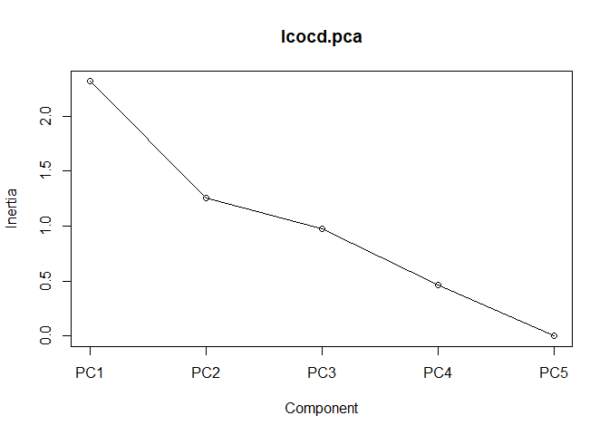
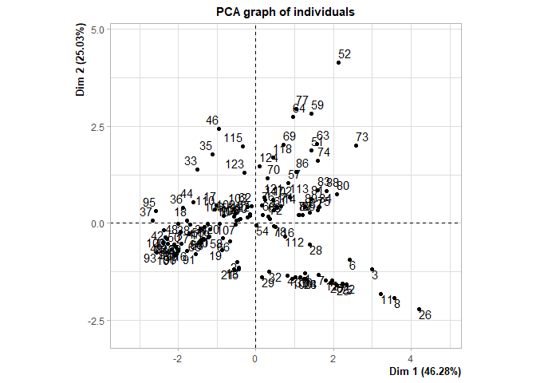
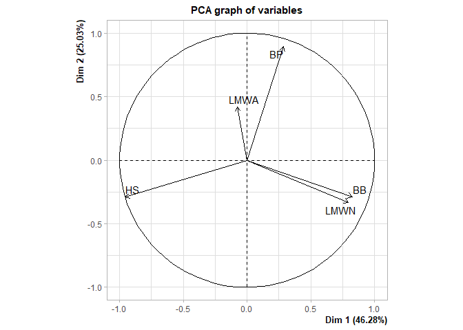
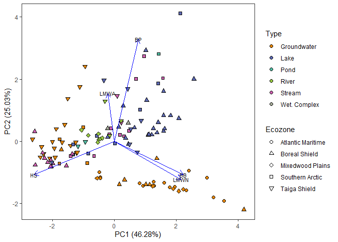

Statistical Analyses
================
PJKA

# Setup

## Install Packages and Import Data

``` r
#Load required libraries
library(tidyverse)
library(vegan)
library(ggfortify)
library(rcartocolor)
library(patchwork)
library(EcolUtils)


#Import dataset file from WLU Dataverse
EnvDOM <- read.csv("Aukes-DOM_Comp_Data-dataset.csv")

#Average samples to result in one value per sampling site
avg_all <- EnvDOM %>%
  select("Env", "Location","Ecozone","Type","LocType","Sample", "DOC","Hphi","BP","HS","BB","LMWN","LMWA","SUVA") %>%
  group_by(Env, Location,Ecozone,Type,LocType,Sample) %>%
  summarise_all(mean) %>%
  ungroup()

#Rename 'Groundwater' to 'Groundwater'
avg_all <- avg_all %>%
  mutate(Type = replace(Type, Type=='Subsurface', 'Groundwater'),
         Type = replace(Type, Type=='Wet. Subsurface', 'Wet. Groundwater'))
```

## Conform Database

Based on previous analyses, we are removing high-organic subsurface
samples as they skew the analysis (i.e.: we know they are different so
lets remove them for now and see how all the other samples compare).

``` r
pca_avg_all <- avg_all %>%
                  filter(Type != 'Wet. Groundwater')

#Create a dataframe to recalculate LC-OCD output so eluted components are proportions of overall eluted DOM (mgC/L) concentration
#select parameters:
pca_avg_all <- pca_avg_all %>%
  transmute(Env = Env,
            Location = Location,
            Ecozone = Ecozone,
            Type = Type,
            LocType = LocType,
            Sample = Sample,
            DOC = DOC,
            BP = BP/Hphi,
            HS = HS/Hphi,
            BB = BB/Hphi,
            LMWN = LMWN/Hphi,
            LMWA = LMWA/Hphi)
```

## Statistical Analyses

### Create PCA

``` r
#Create a matrix of LC-OCD proportions for input into PCA 
lcocd.matrix <-pca_avg_all[,8:12]

#run PCA
lcocd.pca<- prcomp(lcocd.matrix, center=TRUE, scale.=TRUE)

#look at output of PCA
summary(lcocd.pca)
```

    ## Importance of components:
    ##                           PC1    PC2    PC3     PC4     PC5
    ## Standard deviation     1.5213 1.1187 0.9858 0.68000 0.01306
    ## Proportion of Variance 0.4628 0.2503 0.1943 0.09248 0.00003
    ## Cumulative Proportion  0.4628 0.7131 0.9075 0.99997 1.00000

``` r
screeplot(lcocd.pca, type="lines")
```

<!-- -->

``` r
#create vectors to associate 'rows' with actual sample information
lcocd.pca.Env<-pca_avg_all[,1]
lcocd.pca.Location<-pca_avg_all[,2]
lcocd.pca.Ecozone<-pca_avg_all[,3]
lcocd.pca.Type<-pca_avg_all[,4]
lcocd.pca.LocType<-pca_avg_all[,5]
lcocd.pca.Sample<-pca_avg_all[,6]

#Associated statistics for PCA
#To see loadings:
lcocd.pca$rotation
```

    ##             PC1        PC2         PC3         PC4       PC5
    ## BP    0.1892097  0.7981742 -0.35090508 -0.01883279 0.4512522
    ## HS   -0.6282064 -0.2606311  0.01127603 -0.05668623 0.7308131
    ## BB    0.5420651 -0.2591809  0.20875983  0.64699161 0.4204901
    ## LMWN  0.5225650 -0.2966507  0.01392971 -0.74655602 0.2852792
    ## LMWA -0.0514560  0.3739157  0.91266849 -0.14313617 0.0639342

``` r
#To see individual sample scores:
lcocd.pca$x
```

    ##                PC1          PC2          PC3          PC4           PC5
    ##   [1,]  1.26571038 -1.291530527  0.066255704  0.855296190 -2.445560e-03
    ##   [2,] -0.49016209 -0.984838544 -0.225925044  0.425619062 -3.389312e-04
    ##   [3,]  2.98737871 -1.171306825  1.730179380  0.290557020 -2.348303e-02
    ##   [4,]  0.80679435 -1.338933194 -0.362332606 -1.783382126  1.161036e-01
    ##   [5,]  2.33201958 -1.576284427  0.153414266  0.280756681 -9.363443e-03
    ##   [6,]  2.40098822 -0.942118649 -0.032223604  0.733352606  5.370425e-04
    ##   [7,]  1.61697011 -1.327010418  0.023255556  0.360223130 -6.779261e-03
    ##   [8,]  3.54666652 -1.914772973 -0.257145272 -3.664808105 -2.471088e-02
    ##   [9,]  1.28148744 -1.424981345  0.037711861  0.318902377 -2.681884e-03
    ##  [10,]  0.93267339 -1.425660633 -0.033348080 -0.012438410 -6.862179e-03
    ##  [11,]  3.20140985 -1.805151275  0.305958312  0.345498192 -3.780043e-03
    ##  [12,]  1.78291395 -1.469926683  0.214337893  1.147695735 -2.111458e-03
    ##  [13,] -0.44972069 -1.144032467 -0.293672933 -0.440376080 -8.437953e-03
    ##  [14,]  1.95181665 -1.460482466  0.185383722  0.925915683 -4.605771e-03
    ##  [15,] -0.44876664 -1.182013397 -0.235619258 -0.164202762  4.034103e-03
    ##  [16,] -1.77738942 -0.712988549 -0.311262935  1.056295731  3.935588e-03
    ##  [17,] -1.00393379  0.457506590 -0.378737143  0.270983560  1.516543e-03
    ##  [18,] -1.77412254  0.074395704 -0.163982546  0.086410935  4.578245e-04
    ##  [19,] -0.86970416 -0.694312997 -0.400434805  0.208063290 -8.445849e-04
    ##  [20,]  1.90853698 -1.527162111  0.093172169  0.179463446 -4.295596e-03
    ##  [21,] -0.55870429 -1.181390503 -0.201853823  0.089320954 -2.505359e-03
    ##  [22,]  2.22338481 -1.541709011  0.373145899  0.646512244  1.880529e-03
    ##  [23,]  1.23095514 -1.429419958  0.111376099  0.796039430 -7.420746e-04
    ##  [24,]  1.24298138 -1.433931586  0.089745021  0.645256026  6.534709e-03
    ##  [25,]  2.07958552 -1.597138390  0.080076594 -0.148753385 -5.250921e-03
    ##  [26,]  4.18803777 -2.195514781 -0.043662254 -4.169221655 -8.152594e-03
    ##  [27,] -1.70732460 -0.265727245  1.152308667  0.020677576 -1.491080e-03
    ##  [28,]  1.37354707 -0.547400257  2.267703296  0.695975306  7.243700e-02
    ##  [29,]  0.16386564 -1.381426645 -0.198887292 -0.676702769 -8.385545e-03
    ##  [30,]  1.14514359 -1.389093717  0.117544238  0.971492073 -8.981818e-04
    ##  [31,]  1.02285758 -1.381388321  0.075977433  0.770370189 -1.283298e-03
    ##  [32,]  0.32908340 -1.238231412 -0.195244963 -0.337910803 -6.389056e-03
    ##  [33,] -1.50322857  1.375238360  4.429327499 -0.376927176 -3.457779e-03
    ##  [34,] -1.24500390 -0.022019601 -0.305240016  0.656664092  2.613752e-03
    ##  [35,] -1.11788814  1.760032339  0.140781989 -0.489868402 -3.146111e-04
    ##  [36,] -1.87996924  0.405209421 -0.271813881 -0.173690719 -2.967543e-04
    ##  [37,] -2.64650532  0.072695644 -0.415487923 -0.310664665 -5.487643e-04
    ##  [38,] -1.68511113 -0.023731741 -0.497785578 -0.148706505 -4.378155e-04
    ##  [39,] -1.91382227 -0.513943791 -0.381547539 -0.292970775 -2.020874e-03
    ##  [40,] -1.22031341 -0.364810842  0.329748622  0.170516730 -1.866818e-04
    ##  [41,] -1.19558325 -0.348629517  0.446204065  0.022642306 -1.467153e-03
    ##  [42,] -2.35390418 -0.170924753 -0.290735510 -0.246191692 -5.556839e-04
    ##  [43,] -2.28555319 -0.402177701 -0.444155130 -0.197328027 -7.795532e-04
    ##  [44,] -1.60224116  0.541919924 -0.599152621 -0.052485109  7.588168e-04
    ##  [45,] -2.08864331 -0.535862252 -0.406736235 -0.272420852 -1.800463e-03
    ##  [46,] -0.94373846  2.414729374  5.225388346 -1.521349478 -9.287922e-03
    ##  [47,] -1.41884172 -0.131868241 -0.376399989 -0.414638625 -2.377066e-03
    ##  [48,] -1.99719689 -0.009518845  0.193439244 -0.371166043 -1.393528e-03
    ##  [49,] -2.39292101 -0.505092838 -0.062127080  0.017170979 -4.009170e-04
    ##  [50,] -1.93632549 -0.217245724 -0.324285303  0.261385427  1.072789e-03
    ##  [51,]  1.41592140  1.862261616 -1.405553713 -0.344175523 -1.458875e-03
    ##  [52,]  2.12756094  4.115091095 -2.292194473 -0.366222976  3.281402e-03
    ##  [53,] -1.33684733 -0.422308421  0.225749467 -0.188700293 -2.308435e-03
    ##  [54,]  0.01185236 -0.060585173 -0.432272711  0.112124832 -8.407481e-04
    ##  [55,] -0.56883531  0.175263279  0.018424499 -0.380980126 -2.701265e-03
    ##  [56,] -1.32433788 -0.101687187 -0.364517258 -0.552085161 -3.066862e-03
    ##  [57,]  0.82951939  1.024190917 -0.120588714 -0.025160035 -6.287597e-04
    ##  [58,] -0.84175952 -0.387569458  0.347486016  0.583914899  9.404280e-04
    ##  [59,]  1.43024049  2.814558803 -1.763511764 -0.142119306  2.865917e-03
    ##  [60,]  0.17976137  0.217808730  0.411825377  0.324782260 -1.716996e-04
    ##  [61,]  0.46602337  0.344653787  0.270077531 -0.042601782 -1.831263e-03
    ##  [62,] -0.10853261  0.429377542 -0.001846768 -0.176752290 -1.665233e-03
    ##  [63,]  1.56992700  2.036981833 -0.099581297  0.142152003  1.206353e-03
    ##  [64,]  0.95666550  2.735085993 -0.784742160 -0.392869276  8.113152e-04
    ##  [65,] -1.41203754 -0.467714790  0.143266682 -0.099600922 -1.833482e-03
    ##  [66,] -0.65733723 -0.467834394 -0.487493476  0.168291262 -7.423836e-04
    ##  [67,] -0.15512353  0.234458548  0.380557910 -0.249794381 -2.591806e-03
    ##  [68,]  0.31090853  0.171550239  0.700534182  0.119005004 -1.556783e-03
    ##  [69,]  0.70362573  2.013528639 -1.293369102 -0.446706949 -1.483309e-05
    ##  [70,]  0.29150835  1.146631624 -0.886446230 -0.763788411 -2.911247e-03
    ##  [71,]  0.64692780  0.442267761  0.656716502  0.304805544 -4.648455e-04
    ##  [72,]  0.36570726  0.108589677  0.278076060  0.198947832 -9.900579e-04
    ##  [73,]  2.57287693  2.003713332 -1.285643356  0.375442460  1.767083e-03
    ##  [74,]  1.59456072  1.613714018  0.456872275 -0.189690299 -1.515460e-03
    ##  [75,]  1.59397109  0.342656588 -0.270074784 -0.001486636 -2.107496e-03
    ##  [76,]  0.14484786  0.466321280 -0.309555908  0.497843214  1.648330e-03
    ##  [77,]  1.02463835  2.935495903 -0.892445486  0.132813294  3.670253e-03
    ##  [78,]  0.45685524 -0.083405940  0.444474517  0.564203617  2.359630e-04
    ##  [79,]  1.09358991  0.209187813 -0.658916625  0.214455261 -6.373758e-04
    ##  [80,]  2.08560548  0.744796435  0.333533442  0.225593994 -1.236734e-03
    ##  [81,]  1.41926785  0.614983265  0.523206916 -0.002589511 -2.155372e-03
    ##  [82,]  1.37662671  0.279496591 -0.482300473  0.669245326  1.323236e-03
    ##  [83,]  1.59391492  0.841462583 -0.684081231  0.628369189  1.973944e-03
    ##  [84,]  1.62509137  0.410833812 -0.041343216  0.643080298  8.689938e-04
    ##  [85,]  1.20810643  0.216992825  0.233602139  0.634830878  6.299131e-04
    ##  [86,]  1.04346840  1.326582534  0.039676198  0.230443941  7.834721e-04
    ##  [87,]  1.12209036  0.219317309  0.939529421  0.405075061 -9.461364e-04
    ##  [88,]  1.81517682  0.830828501 -0.307389824  0.511007835  9.670682e-04
    ##  [89,]  1.26178964  0.420515812 -0.705899232  0.406952082  4.391687e-04
    ##  [90,] -0.21477788  0.147150171  0.174930715  0.440782487  7.642261e-04
    ##  [91,] -1.54829906 -0.780059654 -0.428858375  0.046687214 -1.051302e-03
    ##  [92,] -2.25439782 -0.533281581 -0.366129067  0.220289361  6.496211e-04
    ##  [93,] -2.55331390 -0.757352008 -0.497367907  0.030870566 -1.478489e-04
    ##  [94,] -2.04745677 -0.602376668 -0.376003413 -0.163335046 -1.383598e-03
    ##  [95,] -2.57021758  0.322069590 -1.123848624 -1.137607128  4.040366e-04
    ##  [96,] -2.03687545 -0.795365878 -0.469612382 -0.077495642 -1.006141e-03
    ##  [97,] -2.15314002 -0.677186202 -0.530390453 -0.359155085 -2.294504e-03
    ##  [98,] -1.35714861 -0.401546756 -0.585751927 -0.694535012 -4.031561e-03
    ##  [99,] -1.99272332 -0.708604244 -0.122288029  0.265784801  1.841107e-04
    ## [100,] -2.31506556 -0.368508705  0.129075789 -0.486608344 -2.790484e-03
    ## [101,] -2.05966390 -0.818116128 -0.341397850  0.191795885 -1.209140e-04
    ## [102,]  0.45049720  0.598920770  0.113829311  0.158848317 -3.250758e-04
    ## [103,] -0.21731984  0.421841604 -0.283614843 -0.050818286 -7.707159e-04
    ## [104,] -0.50153829  0.062527657 -0.677624227  0.065043464 -1.851393e-04
    ## [105,] -0.44956027  0.086192667 -0.730096633 -0.005961532 -6.434905e-04
    ## [106,] -0.83845809  0.199967802 -0.631926758  0.015741707 -8.638347e-07
    ## [107,] -0.52920691 -0.023831034 -0.682171628 -0.184019553 -1.457359e-03
    ## [108,] -0.39097930  0.108208705 -0.672926191 -0.053383025 -9.753881e-04
    ## [109,] -0.51145090  0.244000649 -0.457616166 -0.009092126 -5.932370e-04
    ## [110,] -1.06078777  0.366802315  0.283668282 -0.154378310 -1.276634e-03
    ## [111,] -2.01348056 -0.671612341 -0.189348713  0.009143510 -9.092606e-04
    ## [112,]  0.74225244 -0.343159005  0.458540119  0.056821542 -2.838081e-03
    ## [113,]  0.86751413  0.668009273  0.506238921  0.354682110  8.183088e-05
    ## [114,]  0.53712674  0.394919750  0.007579770  0.094308937 -9.774839e-04
    ## [115,] -0.33682867  1.971233230  4.818083904  0.303307657 -4.802208e-04
    ## [116,]  0.49630032 -0.092751744  0.590572949  0.422607891 -5.993581e-04
    ## [117,]  0.22808927  0.608005442 -0.008581223  0.283260887  5.539675e-04
    ## [118,]  0.43292505  1.686317513 -0.773363090  0.009968157  2.111541e-03
    ## [119,] -1.17227981 -0.157401470  0.520564388  0.085454293 -1.475217e-03
    ## [120,] -0.93824355 -0.012258716  0.044234457 -0.051903970 -1.165749e-03
    ## [121,]  0.22081627  0.662539233 -0.568478139  0.027971957 -6.103997e-03
    ## [122,] -0.14715669  0.193430325 -0.029739295  0.127790599 -1.095769e-02
    ## [123,] -0.30236747  1.295450788  2.575201967 -0.655205610 -1.909595e-03
    ## [124,]  0.09521083  1.467709131 -0.641863482  0.161428310  1.967860e-03

``` r
#To get eigenvalues:
lcocd.pca$sdev^2
```

    ## [1] 2.3142121051 1.2514824637 0.9717408612 0.4623940065 0.0001705635

``` r
#this package offers a nice way to obtain correlation between variables and PC
library(FactoMineR)
lcocd.pca2 <- PCA(lcocd.matrix)
```

<!-- --><!-- -->

``` r
#eigenvalue:
lcocd.pca2$eig
```

    ##          eigenvalue percentage of variance cumulative percentage of variance
    ## comp 1 2.3142121051           46.284242103                          46.28424
    ## comp 2 1.2514824637           25.029649274                          71.31389
    ## comp 3 0.9717408612           19.434817225                          90.74871
    ## comp 4 0.4623940065            9.247880129                          99.99659
    ## comp 5 0.0001705635            0.003411269                         100.00000

``` r
#corr b/w variables and PC
lcocd.pca2$var$coord
```

    ##            Dim.1      Dim.2       Dim.3       Dim.4        Dim.5
    ## BP    0.28783591  0.8929149 -0.34591141  0.01280622 0.0058933513
    ## HS   -0.95566109 -0.2915672  0.01111557  0.03854638 0.0095444145
    ## BB    0.82461837 -0.2899448  0.20578901 -0.43995144 0.0054915982
    ## LMWN  0.79495386 -0.3318622  0.01373148  0.50765480 0.0037257445
    ## LMWA -0.07827763  0.4182983  0.89968046  0.09733197 0.0008349802

### Plot PCA

``` r
autoplot(lcocd.pca, scale = 0, 
         data=pca_avg_all, 
         fill = 'Type', shape= 'Ecozone', size =2,
         loadings=TRUE, loadings.colour = 'blue',
         loadings.label= TRUE, loadings.label.colour = 'black',loadings.label.size=3)+
  scale_fill_carto_d(palette = 'Vivid')+
  scale_shape_manual(values=c(21,24,23,22,25))+
  guides(fill= guide_legend(override.aes = list(shape=21)) )+
  theme_bw()+
  theme(panel.grid = element_blank())
```

<!-- -->

### PERMANOVA Calculation

Here we ask whether water body type is significantly different. We do
not have a fully balanced design to assess the interaction of ‘Ecozone’,
but instead nest it within the function:

``` r
adonis2(lcocd.matrix ~ Type, data = pca_avg_all, permutations = 999, method='euclidean', strata='Ecozone')
```

    ## Permutation test for adonis under reduced model
    ## Terms added sequentially (first to last)
    ## Permutation: free
    ## Number of permutations: 999
    ## 
    ## adonis2(formula = lcocd.matrix ~ Type, data = pca_avg_all, permutations = 999, method = "euclidean", strata = "Ecozone")
    ##           Df SumOfSqs      R2      F Pr(>F)    
    ## Type       5   0.7859 0.19644 5.7695  0.001 ***
    ## Residual 118   3.2146 0.80356                  
    ## Total    123   4.0005 1.00000                  
    ## ---
    ## Signif. codes:  0 '***' 0.001 '**' 0.01 '*' 0.05 '.' 0.1 ' ' 1

As the p-value\<0.01, we reject the null hypothesis and can say that
there is a significant difference in DOM composition between water body
types.

### Post hoc comparisons

The PERMANOVA indicates that there are statistical differences, but does
not show where. Here we conduct a pairwise a postereri test to show
significance between means of different water body types using a Dunn’s
Test.

``` r
#Using EcolUtils package
adonis.pair(vegdist(pca_avg_all[,8:12]), as.factor(pca_avg_all$Type), corr.method = 'bonferroni', nper = 8000)
```

    ## 'nperm' >= set of all permutations: complete enumeration.

    ## Set of permutations < 'minperm'. Generating entire set.

    ##                     combination   SumsOfSqs     MeanSqs    F.Model          R2
    ## 1          Groundwater <-> Lake 0.354221939 0.354221939 16.9983845 0.168303528
    ## 2          Groundwater <-> Pond 0.043102399 0.043102399  1.7206329 0.032636803
    ## 3         Groundwater <-> River 0.074057787 0.074057787  3.5102084 0.057067087
    ## 4        Groundwater <-> Stream 0.107608723 0.107608723  4.6174199 0.061062913
    ## 5  Groundwater <-> Wet. Complex 0.020766332 0.020766332  0.8568302 0.016847889
    ## 6                 Lake <-> Pond 0.026962584 0.026962584  1.6400939 0.042445392
    ## 7                Lake <-> River 0.088157182 0.088157182  6.9969112 0.137202647
    ## 8               Lake <-> Stream 0.316911147 0.316911147 18.3324621 0.243354081
    ## 9         Lake <-> Wet. Complex 0.005137037 0.005137037  0.3408830 0.009380152
    ## 10               Pond <-> River 0.005420888 0.005420888  0.7316341 0.062364215
    ## 11              Pond <-> Stream 0.020427196 0.020427196  0.9566297 0.038331687
    ## 12        Pond <-> Wet. Complex 0.004441894 0.004441894  0.1913531 0.059959850
    ## 13             River <-> Stream 0.014291239 0.014291239  0.9660724 0.030221804
    ## 14       River <-> Wet. Complex 0.005270407 0.005270407  3.3468503 0.250759559
    ## 15      Stream <-> Wet. Complex 0.018607750 0.018607750  0.9580367 0.039988113
    ##         P.value P.value.corrected
    ## 1  0.0001249844       0.001874766
    ## 2  0.2034745657       1.000000000
    ## 3  0.0494938133       0.742407199
    ## 4  0.0206224222       0.309336333
    ## 5  0.4268216473       1.000000000
    ## 6  0.1881014873       1.000000000
    ## 7  0.0042494688       0.063742032
    ## 8  0.0002499688       0.003749531
    ## 9  0.6420447444       1.000000000
    ## 10 0.3883264592       1.000000000
    ## 11 0.3259592551       1.000000000
    ## 12 1.0000000000       1.000000000
    ## 13 0.3333333333       1.000000000
    ## 14 0.0778652668       1.000000000
    ## 15 0.3855768029       1.000000000
